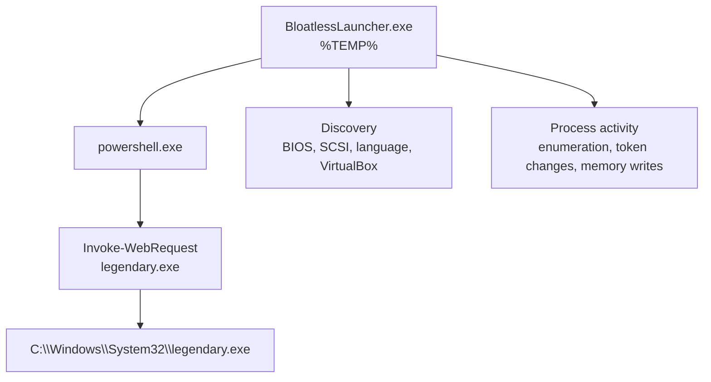

# grabber.cy analysis

Defensive analysis repository for the `grabber.cy` sample reported as `BloatlessLauncher.exe`.

> Scope: documentation, indicators, and detection engineering only. This repository is a reporting package, not a loader, builder, or deployment kit.

## Snapshot

| Field | Value |
| --- | --- |
| Target | `BloatlessLauncher.exe` |
| Sample ID | `260618-tkb2eabs91` |
| Score | `8/10` |
| SHA256 | `44744c2dada4e757d2d66115d2ab036e6d4525866709cf407d7549a326088fa2` |
| SHA1 | `3f7683d4cd0b860a96b1aaabab12c6e2aecc522d` |
| MD5 | `ebcd2f99c84f8bd59485cdae93d2e746` |
| Primary behavior | PowerShell downloader + discovery + process manipulation |

## What the sample did

The original report shows a chained execution pattern that looks much more like a dropper or grabber than a one-off script. The sample reached out through PowerShell, wrote a binary into `System32`, and then mixed in host discovery and environment checks that are common in evasive malware.

## Repo map

- `reports/grabber-cy-summary.md`: polished executive summary
- `analysis/README.md`: index for the analysis bundle
- `analysis/briefing.md`: analyst-facing narrative and key judgments
- `analysis/process-chain.md`: step-by-step process and file chain
- `analysis/network.md`: network observations and infrastructure notes
- `analysis/mitre.md`: ATT&CK mapping
- `data/observed-iocs.json`: normalized observable data
- `detections/bloatlesslauncher-powershell-downloader.yml`: Sigma detection for the PowerShell download pattern
- `publish-to-github.bat`: one-command GitHub publishing helper

## High-signal indicators

- `BloatlessLauncher.exe` launched from `%TEMP%`
- `powershell.exe` used `Invoke-WebRequest` to fetch `legendary.exe`
- `C:\Windows\System32\legendary.exe` was created
- VirtualBox artifacts were queried, including `\\??\\VBoxMiniRdrDN`
- Registry and BIOS discovery touched `SYSTEM\\...\\Enum\\SCSI` and `HARDWARE\\DESCRIPTION\\System\\BIOS`
- The sample contacted `anondrop.net`, `doxbin.com`, `doxbin.net`, `ethereum.publicnode.com`, and `servus.doxbin.cy`

## Detection notes

The shipped Sigma rule is intentionally narrow enough to be useful without becoming a wall of false positives. It keys on PowerShell execution plus a download-to-system-directory pattern that mirrors the observed behavior.

## Publishing

Run `publish-to-github.bat` from the repository root to initialize Git, set or reuse `origin`, create a first commit if needed, and push to `main`.

## Source note

The original markdown report was preserved and mined for indicators, process behavior, and network evidence. Everything in this repository is organized for defensive analysis and publication.
